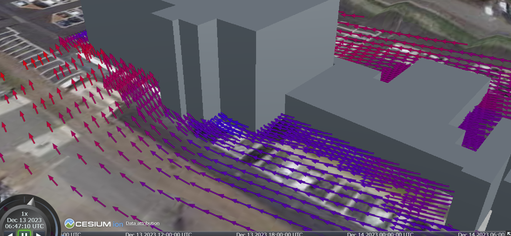
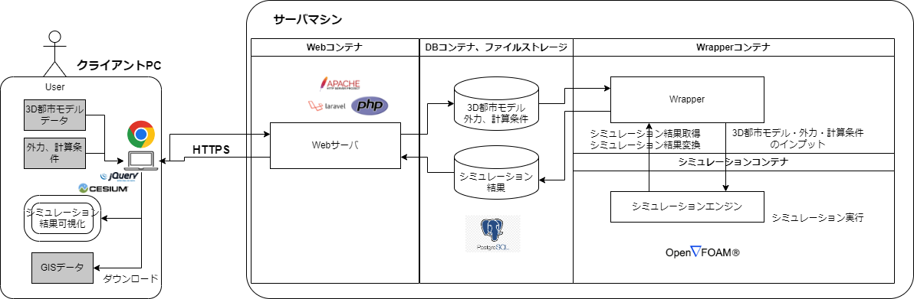

# 熱流体シミュレーションシステム

## 1.概要
本リポジトリでは、Project PLATEAUの令和5年度「都市デジタルツインの実現に向けた研究開発及び実証調査業務」（内閣府/研究開発とSociety5.0との橋渡しプログラム（BRIDGE））におけるUC23-25「3D都市モデルを活用した熱流体シミュレーションシステムの開発」（熱流体に関する大規模シミュレーション）において開発した「熱流体シミュレーションシステム」のソースコードを公開しています。

「熱流体シミュレーションシステム」は、ウェブ上で実施可能な3D 都市モデルを利用した熱流体シミュレーションシステムです。

## 2.「3D都市モデルを活用した熱流体シミュレーションシステムの開発」について

3D都市モデルを用いた大規模なシミュレーション技術は高負荷のコンピューティングを前提とするものが多く、その実施はオンプレミスの専門ツールを用いることが一般的です。他方、3D 都市モデルが普及するにつれ、地方公共団体職員等のノンエンジニア属性のユーザが簡易にシミュレーションを実施して業務に活用するニーズが高まっています。
本ユースケースでは、GUIを備えたウェブアプリとしての機能提供を行うことにより、利便性を考慮した直感的に理解しやすい操作性を担保するGUIを備えたウェブアプリとしての温熱環境シミュレータを実現しました。本システムにより、地方公共団体職員  等のノンエンジニア属性のユーザが、簡易にシミュレーションを実施して業務に活用するニーズに応えることを目指しています。

## 3.利用手順
本システムの構築手順及び利用手順は[利用チュートリアル](https://project-plateau.github.io/Fluid-dynamics-simulator/)を参照してください。

## 4.システム概要

### ユーザ認証・データ共有機能

ユーザをログイン認証し、当該ユーザがこれまでにこのウェブアプリで登録した3D都市モデルやシミュレーションモデルを一覧表示します。またプリセットされたサンプルモデルや、他のユーザから共有されたモデルについても、閲覧および複製できます。

### 熱流体解析機能

ウェブアプリの画面上で外気温などの外力等環境条件を入力し、外部システムでデータ変換した3D都市モデル（STLファイル）をウェブアプリにアップロードすることで、サーバの計算機資源を用いて温熱環境シミュレーションを実行することができます。
熱流体解析ソフトとしては[OpenFOAM](https://www.openfoam.com/)を利用します。標準のソルバを用いるノンエンジニアのユーザは、OpenFOAMの入出力や計算仕様を理解する必要はありません。また熱流体解析に精通したユーザはOpenFOAMのソルバや設定をカスタマイズして利用することも可能です（詳細についてはdocsフォルダのシミュレーションモデル仕様書をご参照ください）。

### シミュレーション結果可視化機能

温熱環境シミュレーション結果（風況、中空温度、暑さ指数）を示す矢印やヒートマップを、[PLATEAU-3DTilesの配信サービス](https://github.com/Project-PLATEAU/plateau-streaming-tutorial/blob/main/3d-tiles/plateau-3dtiles-streaming.md)などで提供されている3D都市モデル(3Dタイル)および地形モデルに重畳してウェブアプリの画面上に表示します。また温熱環境シミュレーション結果をGeoJSONファイル形式でダウンロードすることができます。

### シミュレーション結果一般公開機能

温熱環境シミュレーション結果について、本システムのログインアカウントを持たない利用者も閲覧可能なURLを発行することができます。

## 5. 利用技術

### ウェブアプリ構成要素

| 内容            | 項目   |製品バージョン|
| ----------------- | ----------------- | ---------- |
| OS|Ubuntu|22.04.3 LTS|
| Webサーバ機能 | Apache Server |2.4.52|
| Webフレームワーク（フロントエンド）|Bootstrap|5.2.3|
| Webアプリ依存ライブラリ（フロントエンド） | jQuery|3.7.1|
| | jQuery　UI|1.13.2|
| | CesiumJS |1.104|
| | Leaflet |1.9.4|
| Webフレームワーク（バックエンド） | Laravel |10.28.0|
| Webアプリインタプリタ（バックエンド）| PHP|8.1|
| Webアプリ依存ライブラリ（バックエンド）| NodeJS|12.22.9|
| | npm|8.5.1|
| データベースエンジン | PostgresSQL |15.4|
| Wrapperコンテナモジュールインタプリタ | Python |3.10.12|
| Wrapperコンテナモジュール依存ライブラリ| pip|24.0|
| | pyproj|3.6.1|
| | NumPy|1.26.4|
| | SQLAlchemy|2.0.23|
| | psycopg2|2.9.9|
| | paramiko|3.3.1|
| 熱流体解析 | OpenFOAM (ESI-OpenCFD) |2206|

### 環境構築

| 内容            | 項目   |製品バージョン|
| ----------------- | ----------------- | ---------- |
| 仮想化|docker|24.0.6|
| |docker compose|2.22.0|
| ファイル構成管理| Git|2.43.0|
| データベースGUI製品 | pgAdmin 4|8.3|

### 対向システム

| 内容            | 項目（例）   |
| ----------------- | ----------------- |
| 3Dタイル配信 | PLATEAUストリーミング配信サービス |
| 2Dタイル配信 | 地理院タイル |
| データ変換ツール | FME Desktop |
| GISソフトウェア | QGIS |

## 6. 動作環境

### ハードウェア構成

本システムの稼働環境は、利用者端末であるクライアントPCおよびネットワーク接続するサーバマシンの各ハードウェアより構成されます。サーバマシンでは複数のマシン（コンテナ）から構成され、うちWebコンテナがクライアントPC上のブラウザに対してウェブアプリをホストし、他のコンテナはWebコンテナと結合して諸機能を提供します。

### ソフトウェア環境（クライアントPC）

| 項目               　| 最小動作環境   　　　　　　　　　　　　　　　　  　　　　| 推奨動作環境            　　　 | 
| ------------------ | ---------------------------------- | ------------------------- |
| ブラウザ 　　　　　　　　　　　　　| JavaScript、jQuery、CesiumJS対応ブラウザ | Google Chrome　120.0以上　|
| ディスプレイ解像度 | 1920×1080以上                   | 1920×1080以上                   | 
| ネットワーク      | 以下のURLを閲覧可能。  ・サーバマシンのWebアプリ ・[PLATEAU-3DTilesの配信サービス](https://github.com/Project-PLATEAU/plateau-streaming-tutorial/) | インターネット接続 | 

### ソフトウェア環境（サーバマシン - Webコンテナ）

| 項目               　| 最小動作環境   　　　　　　　　　　　　　　　　  　　　　| 推奨動作環境            　　　 | 
| ------------------ | ---------------------------------- | ------------------------- |
| OS | Ubuntu    |Dockerファイルに依り立ち上げた仮想環境|
| ネットワーク      | クライアントPCとHTTPSでのネットワーク接続| インターネット接続、ファイアウォール |
| ネットワーク      | DBコンテナ、ファイルストレージとのネットワーク接続| サーバマシン内でのVPN |

### ソフトウェア環境（サーバマシン - DBコンテナ）

| 項目               　| 最小動作環境   　　　　　　　　　　　　　　　　  　　　　| 推奨動作環境            　　　 | 
| ------------------ | ---------------------------------- | ------------------------- |
| DBMS | PostgresSQL    |同左| 
| ネットワーク      | Webコンテナ、Wrapperコンテナとのネットワーク接続| サーバマシン内でのVPN |

### ソフトウェア環境（サーバマシン - ファイルストレージ）

| 項目               　| 最小動作環境   　　　　　　　　　　　　　　　　  　　　　| 推奨動作環境            　　　 | 
| ------------------ | ---------------------------------- | ------------------------- |
| ファイルシステム | Ubuntu(Webコンテナ、Wrapperコンテナ)がマウント可能なファイルシステム | Amazon EFSあるいはsamba| 
| ネットワーク      | Webコンテナ、Wrapperコンテナとのネットワーク接続| サーバマシン内でのVPN |

### ソフトウェア環境（サーバマシン - Wrapperコンテナ）

| 項目               　| 最小動作環境   　　　　　　　　　　　　　　　　  　　　　| 推奨動作環境            　　　 | 
| ------------------ | ---------------------------------- | ------------------------- |
| OS | Ubuntu    |Dockerファイルに依り立ち上げた仮想環境| 
| ネットワーク      | DBコンテナ、ファイルストレージ、シミュレーションコンテナとのネットワーク接続| サーバマシン内でのVPN |

### ソフトウェア環境（サーバマシン - シミュレーションコンテナ）

| 項目               　| 最小動作環境   　　　　　　　　　　　　　　　　  　　　　| 推奨動作環境            　　　 | 
| ------------------ | ---------------------------------- | ------------------------- |
| OS | Ubuntu    |Dockerファイルに依り立ち上げた仮想環境| 
| ネットワーク      | Wrapperコンテナとのネットワーク接続| サーバマシン内でのVPN |
| CPU |i7 6コア　以上 |同左| 
| メモリ |32GB以上|64GB以上|
| ストレージ |1TB以上|2TB以上|

## 7. 本リポジトリのフォルダ構成

| フォルダ名        | 詳細   |
| ----------------- | ----------------- |
| docs | 参考資料（ドキュメント） |
| examples | 参考資料（ドキュメント以外） |
| examples -> input | 本システムにユーザがアップロードするファイルのサンプル |
| examples -> output | 本システムからユーザがダウンロードするファイルのサンプル |
| src | ソースコード |
| src -> container | サーバマシンの各コンテナを仮想化技術により構築するための設定ファイル |
| src -> query | サーバマシンのDBコンテナで動作するデータベースの構築用DDLおよび初期データ投入用DML |
| src -> srcBatch | サーバマシンのWrapperコンテナで動作する熱流体解析の非同期実行管理モジュールのソースコード |
| src -> srcWeb | サーバマシンのWebコンテナで動作するWebアプリのソースコード |
| src -> template | 「標準」ソルバとしてプリセットされているOpenFOAMの入力ファイル （ユーザがアップロードするファイル、Webアプリが動的に生成するファイルを除く） |

なお、ウェブアプリを構成する各モジュールはphp、pythonなどインタプリタ型言語で実装されているため、オブジェクトプログラム(バイナリファイル)は構成管理下に含まれません。

## 8. ライセンス

- ソースコードおよび関連ドキュメントの著作権は国土交通省に帰属します。
- 本ドキュメントは[Project PLATEAUのサイトポリシー](https://www.mlit.go.jp/plateau/site-policy/)（CCBY4.0および政府標準利用規約2.0）に従い提供されています。

## 9. 注意事項

- 本リポジトリは参考資料として提供しているものです。動作保証は行っておりません。
- 予告なく変更・削除する可能性があります。
- 本リポジトリの利用により生じた損失及び損害等について、国土交通省はいかなる責任も負わないものとします。

## 10. 参考資料
- PLATEAU Webサイト Use caseページ「3D都市モデルを活用した熱流体シミュレーションシステムの開発」: https://www.mlit.go.jp/plateau/use-case/uc23-025/
