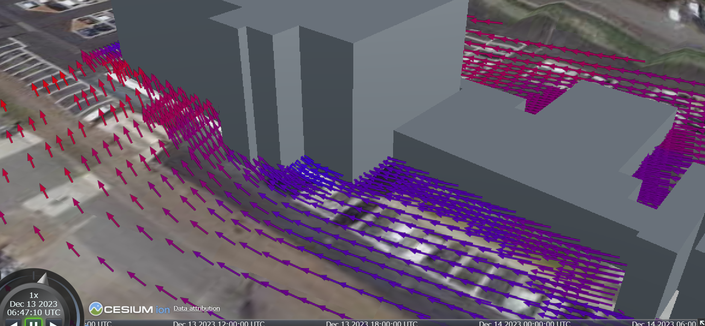

# 熱流体シミュレーションシステム

本リポジトリでは、Project PLATEAUの令和5年度「都市デジタルツインの実現に向けた研究開発及び実証調査業務」におけるUC25「熱流体シミュレーションシステムの開発」（熱流体に関する大規模シミュレーション）において開発した「熱流体シミュレーションシステム」のソースコードを公開しています。

「熱流体シミュレーションシステム」は、ウェブ上で実施可能な3D 都市モデルを利用した熱流体シミュレーションシステムです。

