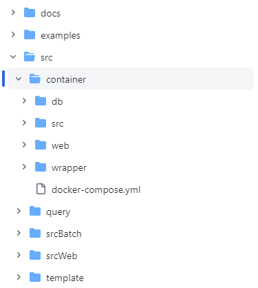

# 環境構築手順・インストール

本書では3D都市モデルを活用した熱流体シミュレーションシステム（以下「本システム」という。）の利用環境構築手順について記載しています。
本システムの構成や仕様の詳細については以下も参考にしてください。

# 1. 事前準備・推奨条件

はじめに、本システムを利用する際は、
[動作環境](https://github.com/Project-PLATEAU/)
で示すサーバマシン内の構成を２台のマシンに分けて構成することを推奨します。また、OSはどちらのマシンもUbuntuを推奨します。

上記に伴い、本書では２台のサーバマシンを以下のように定義し、構築手順を記載します。

- コンテナ管理用マシン
    - Webコンテナ、DBコンテナ、Wrapperコンテナ、APIコンテナを管理するマシン
    - パブリックIPアドレスとホスト名（必要であればドメイン、SSL証明書）を取得し、FQDNでアクセスできるようにする。\
  ※任意のドメインプロバイダ、またはAWS等パブリッククラウドサービスからパブリックIPアドレス、ドメイン、ホスト名等を取得してください。本書での取得手順の詳細は省略します。

- コンテナ管理用マシンに接続されたファイルストレージ
    - Webコンテナ、DBコンテナ、Wrapperコンテナ、APIコンテナから参照できるファイルサーバーやストレージ\
  ※本システムのファイルストレージは、コンテナ管理用マシンにアクセスできる環境であれば、コンテナ管理用マシンに接続したハードディスク、または別のNASやパブリッククラウドサービス（Amazon EFS等）のいずれを利用しても問題ございません。そのため、本書でのインストール手順の詳細は省略します。

- シミュレータ用マシン
    - 熱流体シミュレーションの稼働に十分なスペックであるマシン

## 1.1. データベース情報の検討
本システムの環境構築を効率よく進めていくうえで、データベース情報を事前に定義しておくことを推奨します。
下記、３点(データベースのユーザー名、データベースのパスワード、データベース名)を検討し、手元に記録または管理してください。
 - [DB_USER]
 - [DB_PASSWORD]
 - [DB_NAME]

## 1.2. ファイルストレージのマウント
コンテナ管理用マシンに接続されたファイルストレージをコンテナ管理用マシンの/mntにマウントしてください。
マウント方法はストレージによって異なるため、本書では省略いたします。

## 1.3. Dockerインストール
本システムのコンテナ管理用マシンでは、Docker Engine および Docker Composeを利用します。\
未インストールの方は以下参考にインストールから実施してください。

### Docker Engine
詳細は、
[公式サイト](https://docs.docker.com/engine/install/ubuntu/)
をご覧ください。

本書では、新しいマシンに初めてDocker エンジンをインストールすることを想定し、公式サイトでも紹介されている aptリポジトリを使用したインストール方法を記載します。\
以下手順に沿って、コマンドを実行してください。

1. Docker の'apt'リポジトリを設定
```
# Add Docker's official GPG key:
sudo apt-get update
sudo apt-get install ca-certificates curl
sudo install -m 0755 -d /etc/apt/keyrings
sudo curl -fsSL https://download.docker.com/linux/ubuntu/gpg -o /etc/apt/keyrings/docker.asc
sudo chmod a+r /etc/apt/keyrings/docker.asc

# Add the repository to Apt sources:
echo \
  "deb [arch=$(dpkg --print-architecture) signed-by=/etc/apt/keyrings/docker.asc] https://download.docker.com/linux/ubuntu \
  $(. /etc/os-release && echo "$VERSION_CODENAME") stable" | \
  sudo tee /etc/apt/sources.list.d/docker.list > /dev/null
sudo apt-get update
```

2. Docker パッケージのインストール
```
sudo apt-get install docker-ce docker-ce-cli containerd.io docker-buildx-plugin docker-compose-plugin
```

3. インストール成功確認
```
sudo docker run hello-world
```

### Docker Compose
詳細は、
[公式サイト](https://docs.docker.com/compose/install/linux/#install-using-the-repository)
をご覧ください。

本書では、Docker Engine をインストールした人が続けて Docker Compose をインストールすることを想定し、上記と同様に公式サイトでも紹介されている aptリポジトリを使用したインストール方法を記載します。\
以下手順に沿って、コマンドを実行してください。

1. パッケージインデックスの更新
```
sudo apt-get update
```

2. Docker Compose のインストール
```
sudo apt-get install docker-compose-plugin
```

3. インストール成功確認
```
docker compose version
```

# 2. 動作環境

本システムは、利用者端末であるクライアントPCおよびネットワーク接続するサーバマシンの各ハードウェアより構成されます。サーバマシンでは複数のマシン（コンテナ）から構成され、うちWebコンテナがクライアントPC上のブラウザに対してウェブアプリをホストし、他のコンテナはWebコンテナと結合して諸機能を提供します。


動作環境は以下のとおりです。

## 2.1. クライアントPC

| 項目 | 最小動作環境 | 推奨動作環境 |
| - | - | - |
| ブラウザ | JavaScript、jQuery、CesiumJS対応ブラウザ | Google Chrome　120.0以上 |
| ディスプレイ解像度 | 1024×768以上 | 1920×1080以上 |
| ネットワーク | 以下のURLを閲覧可能。 <br>・サーバマシンのWebアプリ<br>・[PLATEAU-3DTilesの配信サービス](https://github.com/Project-PLATEAU/plateau-streaming-tutorial/) | インターネット接続 |

## 2.2. コンテナ管理用マシン - Webコンテナ

| 項目 | 最小動作環境 | 推奨動作環境 |
| - | - | - |
| OS | Ubuntu | Dockerファイルに依り立ち上げた仮想環境 |
| ネットワーク | クライアントPCとHTTPSでのネットワーク接続 | インターネット接続、ファイアウォール設置 |
| ネットワーク | DBコンテナ、APIコンテナ、ファイルストレージとのネットワーク接続 | サーバマシン内でのVPN |

## 2.3. コンテナ管理用マシン - DBコンテナ

| 項目 | 最小動作環境 | 推奨動作環境 |
| - | - | - |
| DBMS | PostgresSQL | 同左 |
| ネットワーク | Webコンテナ、Wrapperコンテナ、APIコンテナとのネットワーク接続 | サーバマシン内でのVPN |

## 2.4. コンテナ管理用マシン - ファイルストレージ

| 項目 | 最小動作環境 | 推奨動作環境 |
| - | - | - |
| ファイルシステム | Ubuntu（Webコンテナ、Wrapperコンテナ）がマウント可能なファイルシステム | Amazon EFSやsamba |
| ネットワーク | Webコンテナ、Wrapperコンテナ、APIコンテナ、とのネットワーク接続 | サーバマシン内でのVPN |

## 2.5. コンテナ管理用マシン - Wrapperコンテナ

| 項目 | 最小動作環境 | 推奨動作環境 |
| - | - | - |
| OS | Ubuntu | Dockerファイルに依り立ち上げた仮想環境 |
| ネットワーク | DBコンテナ、ファイルストレージ、シミュレーショタ用マシンとのネットワーク接続 | サーバマシン内でのVPN |

## 2.6. コンテナ管理用マシン - APIコンテナ

| 項目 | 最小動作環境 | 推奨動作環境 |
| - | - | - |
| OS | Ubuntu | Dockerファイルに依り立ち上げた仮想環境 |
| ネットワーク | Webコンテナ、DBコンテナ、ファイルストレージとのネットワーク接続 | サーバマシン内でのVPN |

## 2.7. シミュレータ用マシン

| 項目 | 最小動作環境 | 推奨動作環境 |
| - | - | - |
| OS | Ubuntu | Dockerファイルに依り立ち上げた仮想環境 |
| ネットワーク | Wrapperコンテナとのネットワーク接続 | サーバマシン内でのVPN |
| CPU |i7 6コア 以上 | 同左 |
| メモリ | 32GB以上 | 64GB以上 |
| ストレージ | 1TB以上 | 2TB以上 |


# 3 コンテナ管理用マシン - Webコンテナ・DBコンテナのセットアップ
## 3.1. Dockerコンテナの作成と起動
コンテナ管理用マシン上に、4つのコンテナの作成から起動までを実施します。\
まずは、自身でソースファイルを実行することで、コンテナを作成することができます。作成に必要なソースファイル一式は
[こちら](https://github.com/Project-PLATEAU/Fluid-dynamics-simulator/tree/main/src/container)
からダウンロード可能です。

GitHubからダウンロードしたソースファイルの構成は以下のようになっています。



ここでは、コンテナ管理用マシン上でコマンドを実行してコンテナを作成するまでの手順を記載します。

1. GitHub mainブランチから[src/container](https://github.com/Project-PLATEAU/Fluid-dynamics-simulator/tree/main/src/container)と[src/secWeb](https://github.com/Project-PLATEAU/Fluid-dynamics-simulator/tree/main/src/srcWeb)を/optにコピー
```
cd /opt/
sudo git clone --no-checkout https://github.com/Project-PLATEAU/Fluid-dynamics-simulator.git
cd Fluid-dynamics-simulator/
sudo git sparse-checkout init --cone
sudo git sparse-checkout add src/container/
sudo git sparse-checkout add src/srcWeb/
sudo git checkout main
cd src/container
```

2. ymlファイルの編集\
docker-compose.ymlファイルを編集します。
```
sudo vi docker-compose.yml
```
事前準備で検討したデータベース情報（データベースのユーザー名、データベースのパスワード、データベース名）をPOSTGRESで始まる以下の３つの設定値に反映します。
```
      POSTGRES_USER: [DB_USER]
      POSTGRES_PASSWORD: [DB_PASSWORD]
      POSTGRES_DB: [DB_NAME]
```
上記編集が終わったらdocker-compose.ymlファイルを保存します。

3. Docker コンテナの作成\
docker-compose.ymlファイルの存在するフォルダ内で以下のコマンドを実行します。\
数分間かけてコンテナが作成されます。
```
sudo docker compose up
```
しばらく動かなくなったところでCtrl+Cでコンテナを終了させます。

4. 作成確認およびコンテナIDの把握
```
sudo docker ps -a
```
出力結果より、container-web、container-db、container-wrapper、container-apiの4つのコンテナに対して、数字12桁で1番左側に出力されている [ CONTAINER ID ] を記録しておきます。

5. コンテナのスタート
container-web、container-db、container-wrapper、container-apiの4つのコンテナを起動します。
以下のコマンドをそれぞれの [ CONTAINER ID ] に対して実行します。
```
sudo docker start [ CONTAINER ID ]
```
以下のコマンドを実行し、Webコンテナ(container-web)/DBコンテナ(container-db)/Wrapperコンテナ(container-wrapper)/APIコンテナ(container-api)の [ STATUS ] がUPになっていることを確認します。
```
sudo docker ps -a
```

## 3.2. Webコンテナ
作成したWebコンテナへアクセスし、Webアプリの動作に必要な設定を実施します。\

1. Webコンテナへアクセス\
コンテナ管理用マシン上で、以下のコマンドでWebコンテナに入ります。
```
sudo docker  exec -it  [Web-CONTAINER ID] /bin/bash
```
カレントディレクトリが/var/www/htmlであることを確認します。

2. 設定ファイルの作成\
サンプルファイル[.env.example]を[.env]という名前でコピーし、[.env]を編集します。

- サンプルファイルのコピー
```
cd srcWeb
cp .env.example .env
```
- 設定ファイルの編集
```
vi .env
```
DB_で始まる項目を以下のように編集します。
[DB_DATABASE]、[DB_USERNAME]、[DB_PASSWORD]には事前準備で検討したデータベース情報（データベース名、データベースのユーザー名、データベースのパスワード）を記入します。
```
DB_CONNECTION=pgsql
DB_HOST=db
DB_PORT=5432
DB_DATABASE=[DB_NAME]
DB_USERNAME=[DB_USERNAME]
DB_PASSWORD=[DB_PASSWORD]
```
APP_NAMEを以下のように編集します。
```
APP_NAME=Fluid-dynamics-simulator
```

3. ライブラリのインストール\
次に、ライブラリをインストールします。同じsrcWebフォルダ内で以下のコマンドを実行します。
```
composer install
```

- 次に、同じsrcWebフォルダ内で「APP_KEY」を生成します。
```
php artisan key:generate
```
- 生成後、.envファイルの「APP_KEY」に自動で入力されていることを確認します。
```
sudo view .env
```

4. storageフォルダの権限設定\
以下のコマンドでsrcWebフォルダ以下のstorageフォルダの所有者を変更する。
```
chown www-data storage/ -R
```

5. リンクの設定\
以下のコマンドでsrcWeb/publicフォルダ以下に/var/www/html/srcWeb/storage/app/public/フォルダへのリンクをstorageという名前で作成する。
```
cd public
ln -s /var/www/html/srcWeb/storage/app/public/ storage
```


## 3.3. DB作成と初期データ投入
1. データベース作成と初期データの投入\
まず、Webコンテナにアクセスし、データベースの作成と初期データを投入するために以下２つのコマンドを実行します。\
初期データ投入前に、初期ユーザーである「testuser」アカウント用のパスワードを設定します。\
/var/www/html/srcWeb/database/seeders/UserAccountSeeder.php
を開きます。
```
cd /var/www/html/srcWeb
vi database/seeders/UserAccountSeeder.php
```

以下の行の''の間に任意のパスワードを追記して保存します。
```
            'password' => '',
```

2. データベースの作成と初期データの投入
以下のコマンドでデータベースの作成と初期データを投入します。
```
# データベースの作成
php artisan migrate --path=/database/migrations/2023_11_01_172302_init_db_ver01.php
php artisan migrate --path=/database/migrations/2024_07_08_135208_ver02.php

# 初期データの投入
php artisan db:seed
```
※上記コマンドで自動で初期データが投入されますが、手動で入力する際は以下からダウンロードできるクエリを適宜編集し、
データを投入してください。
[こちら](https://github.com/Project-PLATEAU/Fluid-dynamics-simulator/tree/main/src/query)


3. ユーザアカウント登録\
pgAdmin 4（https://www.pgadmin.org/download/pgadmin-4-windows/）などのPostgreSQL用GUI管理ツールを用いてデータベースに接続します。\
Host nameにコンテナ管理用マシンのホスト名またはIPアドレス、Portに5432、データベース名は[DB_NAME]で設定したデータベース名、Usernameに[DB_USERNAME]で設定したユーザー名を使用します。\
mainブランチの
[src/query](https://github.com/Project-PLATEAU/Fluid-dynamics-simulator/tree/main/src/query)
にあるINSERT_USER_ACCOUNT.sql を参考にして、必要なユーザアカウントがあればUSER_ACCOUNTテーブルに追加します。

4. STATUS DBの作成\
Wrapperコンテナで使用するstatusdb_simulation_modelテーブルを作成したデータベース[DB_NAME]に作成する。
DDL_STATUSDB.sql(https://github.com/Project-PLATEAU/Fluid-dynamics-simulator/tree/main/src/query)
のクエリを実行し、statusdb_simulation_modelテーブルを作成する。

## 3.4. 共有フォルダの権限設定と標準ソルバーの登録
1. 共有フォルダの権限設定\
sudo chown www-data /mnt -R
2. フォルダを作成\
コンテナ管理用マシン上で以下のコマンドで3D都市モデル、シミュレーションのインプットとアウトプット、標準ソルバー用のフォルダを作成する。
```
sudo mkdir /mnt/city_model
sudo chown www-data /mnt/city_model -R
sudo mkdir /mnt/simulation_input
sudo mkdir /mnt/compressed_solver
sudo mkdir -p /mnt/compressed_solver/default
sudo chown www-data /mnt/compressed_solver -R
sudo mkdir /mnt/simulation_output
sudo mkdir /mnt/converted_output
```
3. 標準ソルバーのダウンロード\
[こちら](https://github.com/Project-PLATEAU/Fluid-dynamics-simulator/tree/main/examples/input/template.tar)から標準ソルバーをダウンロードする。

4. SCPコマンド等で2で作成した/mnt/compressed_solver/default以下に3からダウンロードしたtemplate.tarを配置する。

## 3.5. Webアプリ接続の確認
1. Webアプリへの接続\
事前準備で用意したFQDNを使用してWebコンテナ上のWebアプリにアクセスする。
http://[ コンテナ管理用マシンへのFQDN ]/srcWeb/public/ にアクセスし、熱流体シミュレーションシステムのログイン画面が表示されることを確認します。

2. ログイン
初期ユーザー「testuser」またはユーザーアカウント登録時に登録したユーザーIDとパスワードでログインできることを確認します。

# 4 シミュレーション用マシンのセットアップ
## 4.1. シミュレータ（OpenFOAM）のインストール
1. 事前準備で用意したシミュレーション用マシンにSSH接続します。

2. 下記に示す４つのコマンドを順に実行します。
```
# 1. Add the repository
curl https://dl.openfoam.com/add-debian-repo.sh | sudo bash

# 2. Update the repository information
sudo apt-get update

# 3. Install preferred package. Eg,
sudo apt-get install openfoam2306-default

# 4. .bashrc に OpenFOAM 用のパスを追加
vi .bashrc

以下の行を追記して保存
source /usr/lib/openfoam/openfoam2306/etc/bashrc
```
※sudo apt-get update時に失敗する場合は、/etc/apt/sources.list.d/openfoam.listを開き、
```
deb [arch=arm64] https://dl.openfoam.com/repos/deb jammy main
```
の行を
```
deb [arch=arm64 allow-insecure=yes trusted=yes] https://dl.openfoam.com/repos/deb jammy main
```
のように修正する。

# 5 コンテナ管理用マシン - Wrapperコンテナ・APIコンテナのセットアップ
## 5.1. Wrapperコンテナ
作成したWrapperコンテナへアクセスし、必要な設定を実施します。\
Wrapperコンテナで利用するソースファイル一式は
[こちら](https://github.com/Project-PLATEAU/Fluid-dynamics-simulator/tree/main/src/srcBatch)
からダウンロード可能です。

1. Wrapperコンテナへアクセス\
コンテナ管理用マシン上で、Wrapperコンテナに入ります。
```
sudo docker  exec -it  [wrapper-CONTAINER ID] /bin/bash
```

2. GitHub mainブランチからsrcBatchのソースコードをダウンロードします。
[src/srcBatch](https://github.com/Project-PLATEAU/Fluid-dynamics-simulator/tree/main/src/srcBatch)
をコピーします。
```
cd /opt/
git clone --no-checkout https://github.com/Project-PLATEAU/Fluid-dynamics-simulator.git
cd Fluid-dynamics-simulator/
git sparse-checkout init --cone
git sparse-checkout add src/srcBatch/
git checkout main
cd src/srcBatch/
```
/opt/Fluid-dynamics-simulator/src/srcBatch/ が作成され、その直下にwrapper_organize.pyなどのpythonプログラム群が配置されていることを確認します。

3. Wrapperコンテナとシミュレーション用マシン間のSSH接続のセットアップ\
本システムでは、WrapperコンテナからSSHでシミュレーション用マシンに接続します。\
WrapperコンテナからSSHでシミュレーション用マシンとのSSH接続をセットアップします。\
※環境によってセットアップ手順が異なるため、本書ではセットアップ手順は省略します。\
秘密鍵ファイルをWrapperコンテナ内に配置し、シミュレーション用マシンのホスト名 or IPアドレスと併せて記録しておきます。

4. 設定ファイルの編集\
連携するデータベースの情報とシミュレーションマシンの情報を、設定ファイルに追記します。
以下のコマンドで/opt/Fluid-dynamics-simulator/src/srcBatch/common/config.iniを開きます。
```
vi common/config.ini
```

config.iniを編集します。
- コンテナ管理用マシンに接続されたファイルストレージへのパスを設定します。
今回は、docker-compose.ymlにおいて自動でWrapperコンテナの/mnt/にマウントしているので、以下のように設定します。
```
shared_folder_root = /mnt/
```
- シミュレーション用マシンにログインした際のホームディレクトリのパスを設定します。
```
shared_folder_root = [シミュレーション用マシンにログインした際のホームディレクトリ]
```
- 事前準備にて検討していたデータベース情報を[WebappDB]セクション以降の下記項目に入力します。
```
type = postgresql
user = [DB_USER]
password = [DB_PASSWORD]
host = db
port = 5432
dbname = [DB_NAME]
```

- シミュレーションマシン作成時に記録しておいた情報を[SimEC2]セクション以降の下記項目に入力します。
```
user = [シミュレーション用マシン接続時のユーザー名]
host = シミュレーションマシンのホスト名 or IPアドレス
key_filename = 秘密鍵ファイルのパス（相対パスを入力する場合は、/opt/Fluid-dynamics-simulator/src/srcBatchからの相対パスを設定する）
```
完了後、Ctrl+DなどでWrapperコンテナから出ます。

## 5.2. APIコンテナ
作成したAPIコンテナへアクセスし、必要な設定を実施します。\
APIコンテナで利用するソースファイル一式は
[こちら](https://github.com/Project-PLATEAU/Fluid-dynamics-simulator/tree/main/src/srcAPI)
からダウンロード可能です。

1. APIコンテナへアクセス\
コンテナ管理用マシン上で、APIコンテナに入ります。
```
sudo docker  exec -it  [API-CONTAINER ID] /bin/bash
```

2. GitHub mainブランチからsrcAPIのソースコードをダウンロードします。
[src/srcAPI](https://github.com/Project-PLATEAU/Fluid-dynamics-simulator/tree/main/src/srcAPI)
をコピーします。
```
cd /opt/
git clone --no-checkout https://github.com/Project-PLATEAU/Fluid-dynamics-simulator.git
cd Fluid-dynamics-simulator/
git sparse-checkout init --cone
git sparse-checkout add srcAPI/
git checkout main
cd srcAPI/
```
/opt/Fluid-dynamics-simulator/srcAPI/ が作成され、その直下にconvert_to_czml.pyなどのpythonプログラム群が配置されていることを確認します。

3. 設定ファイルの編集\
連携するデータベースの情報とシミュレーションマシンの情報を、設定ファイルに追記します。
以下のコマンドで/opt/Fluid-dynamics-simulator/src/srcBatch/common/config.iniを開きます。
```
vi common/config.ini
```

config.iniを編集します。

- コンテナ管理用マシンに接続されたファイルストレージへのパスを設定します。
今回は、docker-compose.ymlにおいて自動でAPIコンテナの/mnt/にマウントしているので、以下のように設定します。
```
shared_folder_root = /mnt/
```
- シミュレーション用マシンにログインした際のホームディレクトリのパスを設定します。
```
shared_folder_root = [シミュレーション用マシンにログインした際のホームディレクトリ]
```
- 事前準備にて検討していたデータベース情報を[WebappDB]セクション以降の下記項目に入力します。
```
type = postgresql
user = [DB_USER]
password = [DB_PASSWORD]
host = db
port = 5432
dbname = [DB_NAME]
```

4. API起動
ダウンロードしたソースコードmain.pyを実行して、APIを起動します。
```
cd /opt/Fluid-dynamics-simulator/srcAPI/
uvicorn main:app --host=0.0.0.0 --reload &
```


# 6 シミュレーション管理ジョブの起動
## 6.1. crontabの設定
コンテナ管理用マシンで、1分おきにシミュレーション管理ジョブ(wrapper_organize.py)を実行させるための設定をcrontabに入力します。\
コンテナ管理用マシン上でcrontab を編集します。下記コマンドを実行したとき、Select an editorと出たら開くEditorを設定してください。
```
sudo crontab -e
```
※もし上記コマンド実行後、command not foundが表示された場合は、先に以下のコマンドでcronをインストールしてください。
```
sudo apt-get update
sudo install cron
```

crontabに下記を追記して保存します。
```
* * * * * docker exec -w /opt/Fluid-dynamics-simulator/src/srcBatch <WrapperのContainer ID> sh -c "/usr/bin/python3 /opt/Fluid-dynamics-simulator/src/srcBatch/wrapper_organize.py >> /opt/Fluid-dynamics-simulator/src/srcBatch/log/wrapper.log 2>&1"
```

## 6.2. crontab起動中の確認
crontabがサービス起動中であることを確認します。もし、正常に起動していない場合は再起動します。
```
service cron status　　（起動確認）
service cron restart　　（再起動）
```

上記手順を終えたあとに、Wrapperコンテナへ入り、ログが1分おきに出力されていることを確認します。
```
tail /opt/Fluid-dynamics-simulator/src/srcBatch/wrapper.log
```
- INFO      2024-02-14 02:46:02,109 [wrapper_organize.py:184] Start wrapper_organize.py
- INFO      2024-02-14 02:46:02,161 [wrapper_organize.py:204] Complete wrapper_organize.py
- INFO      2024-02-14 02:47:02,052 [wrapper_organize.py:184] Start wrapper_organize.py
- INFO      2024-02-14 02:47:02,108 [wrapper_organize.py:204] Complete wrapper_organize.py


# 7 プリセットデータの登録と疎通確認

プリセットデータの登録を、環境構築後の疎通確認も兼ねてクライアントPC上のブラウザからウェブアプリにアクセスして実施します。

1. クライアントPC上のブラウザから、http://[ コンテナ管理用マシンへのFQDN ]/srcWeb/public/ にアクセスします。

2. 登録したユーザーIDおよびパスワードで、本システムにログインします。

3. 操作マニュアル[3-2 都市モデルの登録]を参考に、3D都市モデルを登録します。
(examples/input)[こちら](https://github.com/Project-PLATEAU/Fluid-dynamics-simulator/tree/main/examples/input)
からサンプル自治体（横須賀市）の3D都市モデルがダウンロードできます。
サンプル自治体名（横須賀市）を3D Tilesを登録時に選択し、ダウンロードしたSTLファイルを本システムにアップロードします。

4. 操作マニュアル[4-1 シミュレーションモデルの作成]を参考に、シミュレーションモデルの作成およびシミュレーション実行します。\
※横須賀市のサンプルデータにおける緯度経度・高度は以下の通りです。\
南端緯度：35.27833206\
北端緯度：35.284304708\
西端経度：139.6668301\
東端経度：139.6776585\
地面高度：-1\
上空高度：300

5. シミュレーションの実行ステータスが「正常終了」となったら、シミュレーション結果を閲覧します。

6. ダウンロードボタンからGeoJSONファイルをダウンロードします。\
GeoJSONファイルのサンプルは(examples/output)[こちら](https://github.com/Project-PLATEAU/Fluid-dynamics-simulator/tree/main/examples/output)になります。


7. pgAdmin 4などのRDBMSからデータベースに接続し、プリセットする都市モデルおよびシミュレーションモデルのプリセットフラグを有効化します。

```
UPDATE public.city_model SET preset_flag = TRUE WHERE city_model_id = '[対象のcity_model_id]';
UPDATE public.simulation_model SET preset_flag = TRUE WHERE simulation_model_id = '[対象のsimulation_model_id]';
```