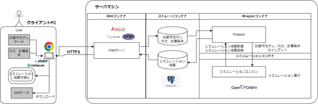

# 環境構築手順・インストール

本書では日射や風況等に基づく温熱環境シミュレーションシステム（以下「本システム」という。）の利用環境構築手順について記載しています。
本システムの構成や仕様の詳細については以下も参考にしてください。

[技術検証レポート](https://www.mlit.go.jp/plateau/file/libraries/doc/plateau_tech_doc_0030_ver01.pdf)

# 1. 事前準備・推奨条件

はじめに、本システムを利用する際は、
[動作環境](https://github.com/Project-PLATEAU/)
で示すサーバマシン内の構成を２台のマシンに分けて構成することを推奨します。また、OSはどちらのマシンもUbuntuを推奨します。

上記に伴い、本書では２台のサーバマシンを以下のように定義し、構築手順を記載します。

- コンテナ管理用マシン
    - Webコンテナ、DBコンテナ、Wrapperコンテナを管理するマシン

- コンテナ管理用マシンに接続されたファイルストレージ
    - Webコンテナ、DBコンテナ、Wrapperコンテナから参照できるファイルサーバーやストレージ\
  ※本システムのファイルストレージは、コンテナ管理用マシンにアクセスできる環境であれば、コンテナ管理用マシンに接続したハードディスク、または別のNASやパブリッククラウドサービス（Amazon EFS等）のいずれを利用しても問題ございません。そのため、本書でのインストール手順の詳細は省略します。

- シミュレータ用マシン
    - 熱流体シミュレーションの稼働に十分なスペックであるマシン

## 1.1. データベース情報の検討
本システムの環境構築を効率よく進めていくうえで、データベース情報を事前に定義しておくことを推奨します。
下記、３点を検討し、手元に記録または管理してください。
 - DB USER
 - DB PASSWORD
 - DB NAME

## 1.2. ファイルストレージのマウント
コンテナ管理用マシンに接続されたファイルストレージをコンテナ管理用マシンの/mntにマウントしてください。
マウント方法はストレージによって異なるため、本書では省略いたします。

## 1.3. Dockerインストール
本システムのコンテナ管理用マシンでは、Docker Engine および Docker Composeを利用します。\
未インストールの方は以下参考にインストールから実施してください。

### Docker Engine
詳細は、
[公式サイト](https://docs.docker.com/engine/install/ubuntu/)
をご覧ください。

本書では、新しいマシンに初めてDocker エンジンをインストールすることを想定し、公式サイトでも紹介されている aptリポジトリを使用したインストール方法を記載します。\
以下手順に沿って、コマンドを実行してください。

1. Docker の'apt'リポジトリを設定
```
# Add Docker's official GPG key:
sudo apt-get update
sudo apt-get install ca-certificates curl
sudo install -m 0755 -d /etc/apt/keyrings
sudo curl -fsSL https://download.docker.com/linux/ubuntu/gpg -o /etc/apt/keyrings/docker.asc
sudo chmod a+r /etc/apt/keyrings/docker.asc

# Add the repository to Apt sources:
echo \
  "deb [arch=$(dpkg --print-architecture) signed-by=/etc/apt/keyrings/docker.asc] https://download.docker.com/linux/ubuntu \
  $(. /etc/os-release && echo "$VERSION_CODENAME") stable" | \
  sudo tee /etc/apt/sources.list.d/docker.list > /dev/null
sudo apt-get update
```

2. Docker パッケージのインストール
```
sudo apt-get install docker-ce docker-ce-cli containerd.io docker-buildx-plugin docker-compose-plugin
```

3. インストール成功確認
```
sudo docker run hello-world
```

### Docker Compose
詳細は、
[公式サイト](https://docs.docker.com/compose/install/linux/#install-using-the-repository)
をご覧ください。

本書では、Docker Engine をインストールした人が続けて Docker Compose をインストールすることを想定し、上記と同様に公式サイトでも紹介されている aptリポジトリを使用したインストール方法を記載します。\
以下手順に沿って、コマンドを実行してください。

1. パッケージインデックスの更新
```
sudo apt-get update
```

2. Docker Compose のインストール
```
sudo apt-get install docker-compose-plugin
```

3. インストール成功確認
```
docker compose version
```

# 2. 動作環境

本システムは、利用者端末であるクライアントPCおよびネットワーク接続するサーバマシンの各ハードウェアより構成されます。サーバマシンでは複数のマシン（コンテナ）から構成され、うちWebコンテナがクライアントPC上のブラウザに対してウェブアプリをホストし、他のコンテナはWebコンテナと結合して諸機能を提供します。



動作環境は以下のとおりです。

## 2.1. クライアントPC

| 項目 | 最小動作環境 | 推奨動作環境 |
| - | - | - |
| ブラウザ | JavaScript、jQuery、CesiumJS対応ブラウザ | Google Chrome　120.0以上 |
| ディスプレイ解像度 | 1024×768以上 | 1920×1080以上 |
| ネットワーク | 以下のURLを閲覧可能。 <br>・サーバマシンのWebアプリ<br>・[PLATEAU-3DTilesの配信サービス](https://github.com/Project-PLATEAU/plateau-streaming-tutorial/) | インターネット接続 |

## 2.2. コンテナ管理用マシン - Webコンテナ

| 項目 | 最小動作環境 | 推奨動作環境 |
| - | - | - |
| OS | Ubuntu | Dockerファイルに依り立ち上げた仮想環境 |
| ネットワーク | クライアントPCとHTTPSでのネットワーク接続 | インターネット接続、ファイアウォール設置 |
| ネットワーク | DBコンテナ、ファイルストレージとのネットワーク接続 | サーバマシン内でのVPN |

## 2.3. コンテナ管理用マシン - DBコンテナ

| 項目 | 最小動作環境 | 推奨動作環境 |
| - | - | - |
| DBMS | PostgresSQL | 同左 |
| ネットワーク | Webコンテナ、Wrapperコンテナとのネットワーク接続 | サーバマシン内でのVPN |

## 2.4. コンテナ管理用マシン - ファイルストレージ

| 項目 | 最小動作環境 | 推奨動作環境 |
| - | - | - |
| ファイルシステム | Ubuntu（Webコンテナ、Wrapperコンテナ）がマウント可能なファイルシステム | Amazon EFSやsamba |
| ネットワーク | Webコンテナ、Wrapperコンテナとのネットワーク接続 | サーバマシン内でのVPN |

## 2.5. コンテナ管理用マシン - Wrapperコンテナ

| 項目 | 最小動作環境 | 推奨動作環境 |
| - | - | - |
| OS | Ubuntu | Dockerファイルに依り立ち上げた仮想環境 |
| ネットワーク | DBコンテナ、ファイルストレージ、シミュレーショタ用マシンとのネットワーク接続 | サーバマシン内でのVPN |

## 2.6. シミュレータ用マシン

| 項目 | 最小動作環境 | 推奨動作環境 |
| - | - | - |
| OS | Ubuntu | Dockerファイルに依り立ち上げた仮想環境 |
| ネットワーク | Wrapperコンテナとのネットワーク接続 | サーバマシン内でのVPN |
| CPU |i7 6コア 以上 | 同左 |
| メモリ | 32GB以上 | 64GB以上 |
| ストレージ | 1TB以上 | 2TB以上 |


# 3 ダウンロード

## 3.1. Dockerコンテナの作成と起動
コンテナ管理用マシン上に、３つのコンテナの作成から起動までを実施します。\
まずは、自身でソースファイルを実行することで、コンテナを作成することができます。作成に必要なソースファイル一式は
[こちら](https://github.com/Project-PLATEAU/Fluid-dynamics-simulator/tree/main/src/container)
からダウンロード可能です。

GitHubからダウンロードしたソースファイルの構成は以下のようになっています。


ここでは、コンテナ管理用マシン上でコマンドを実行してコンテナを作成するまでの手順を記載します。

1. GitHub mainブランチから[src/container](https://github.com/Project-PLATEAU/Fluid-dynamics-simulator/tree/main/src/container)をコピー
```
sudo git clone https://github.com/Project-PLATEAU/Fluid-dynamics-simulator.git src/container
```

2. ymlファイルの編集
事前準備で検討したデータベース情報をPOSTGRESで始まる３つの設定値に反映します。
（ファイルサーバも同様とするか。）
```
vi docker-compose.yml
```
 - POSTGRES_USER: DB USER
 - POSTGRES_PASSWORD: DB PASSWORD
 - POSTGRES_DB: DB NAME

 3. Docker コンテナの作成\
数分間かけてコンテナが作成されます。
```
cd container
sudo docker-compose up
```

 4. 作成確認およびコンテナIDの把握
```
sudo docker ps -a
```

出力結果より、Webコンテナ、DBコンテナ、Wrapperコンテナの[STATUS]がUPになっていることを確認します。また、英数字12桁で1番左側に出力されている[CONTAINER ID]を記録しておきます。

## 3.2. Webコンテナ
作成したWebコンテナへアクセスし、Webアプリの動作に必要な設定を実施します。\
Webコンテナで利用するソースファイル一式は
[こちら](https://github.com/Project-PLATEAU/Fluid-dynamics-simulator/tree/main/src/srcWeb)
からダウンロード可能です。

1. Webコンテナへアクセス

コンテナ管理用マシン上で、WebコンテナのコンテナIDを入力します。
```
sudo docker  exec -it  [Web-CONTAINER ID] /bin/bash
```

2. GitHub mainブランチから
[src/srcWeb](https://github.com/Project-PLATEAU/Fluid-dynamics-simulator/tree/main/src/srcWeb)
をコピー
```
sudo git clone https://github.com/Project-PLATEAU/Fluid-dynamics-simulator.git src/srcWeb
```

3. 設定ファイルの作成

サンプルファイル[.env.example]を参考に、[.env]を編集します。
（編集箇所や記入内容も記載するか相談）
- サンプルファイルの確認方法
```
cd srcWeb
sudo view .env.example
```
- 設定ファイルの新規作成と編集
```
sudo touch .env
sudo vi .env
```
- 次に、「APP_KEY」を生成します。
```
cd srcWeb/bridge-cfd/
php artisan key:generate
```
- 生成後、設定ファイルの「APP_KEY」に自動で入力されていることを確認します。
```
sudo view .env
```

4. ライブラリのインストール\
最後に、ライブラリをインストールします。設定ファイルを作成後に実施します。
```
cd srcWeb/bridge-cfd/
composer install
```

## 3.3. DBコンテナ
作成したDBコンテナへアクセスし、データベースを作成します。\
DBコンテナで利用するクエリ一式は
[こちら](https://github.com/Project-PLATEAU/Fluid-dynamics-simulator/tree/main/src/query)
からダウンロード可能です。

1. データベース作成と初期データの投入

まず、Webコンテナにアクセスし、データベースを作成するために以下のコマンドを実行ます。
```
php artisan migrate --path=/database/migrations/2023_11_01_172302_init_db_ver01.php
```

次に、初期データの投入をするために以下のコマンドを実行します。
```
php artisan db:seed
```

2. DBコンテナへアクセス

コンテナ管理用マシン上で、DBコンテナのコンテナIDを入力します。
```
sudo docker  exec -it  [DB-CONTAINER ID] /bin/bash
```

3. ユーザアカウント登録

pgAdmin 4などのRDBMSからデータベースに接続します。mainブランチの
[src/query](https://github.com/Project-PLATEAU/Fluid-dynamics-simulator/tree/main/src/query)
にあるINSERT_USER_ACCOUNT.sql を参考にして、必要なユーザアカウントを登録します。

## 3.4. シミュレーションマシン
1. OpenFOAM インストール\
下記に示す４つのコマンドを順に実行します。
```
# 1. Add the repository
curl https://dl.openfoam.com/add-debian-repo.sh | sudo bash

# 2. Update the repository information
sudo apt-get update

# 3. Install preferred package. Eg,
sudo apt-get install openfoam2306-default

# 4. .bashrc に OpenFOAM 用のパスを追加
source /usr/lib/openfoam/openfoam2306/etc/bashrc
```

2. .pemファイルの作成\
本システムでは、シミュレーションマシンとWrapperコンテナでSSH接続による通信を利用します。\
.pemファイル作成後、シミュレーションマシンのホスト名 or IPアドレスと併せて記録しておきます。

## 3.5. Wrapperコンテナ
作成したWrapperコンテナへアクセスし、必要な設定を実施します。\
Wrapperコンテナで利用するソースファイル一式は
[こちら](https://github.com/Project-PLATEAU/Fluid-dynamics-simulator/tree/main/src/srcBatch)
からダウンロード可能です。

1. Wrapperコンテナへアクセス\
コンテナ管理用マシン上で、WrapperコンテナのコンテナIDを入力します。
```
sudo docker  exec -it  [wrapper-CONTAINER ID] /bin/bash
```

2. GitHub mainブランチから
[src/srcBatch](https://github.com/Project-PLATEAU/Fluid-dynamics-simulator/tree/main/src/srcBatch)
をコピーします。
```
mkdir /bridge-plateau-cfd & cd /bridge-plateau-cfd
sudo git clone https://github.com/Project-PLATEAU/Fluid-dynamics-simulator.git src/srcBatch
```
/bridge-plateau-cfdが作成され、その直下にwrapper_organize.pyなどのpythonプログラム群が配置されていることを確認します。

3. .pemファイルの作成（任意）\
本システムでは、シミュレーションマシンとWrapperコンテナでSSH接続による通信を利用します。


4. 設定ファイルの編集\
連携するデータベースの情報とシミュレーションマシンの情報を、設定ファイルに追記します。

- 事前準備にて検討していたデータベース情報を[WebappDB]セクション以降の下記項目に入力します。
  - user = DB USER
  - password = DB PASSWORD
  - dbname = DB NAME

- シミュレーションマシン作成時に記録しておいた情報を[SimEC2]セクション以降の下記項目に入力します。
  - user = ubuntu (※)
  - host = シミュレーションマシンのホスト名 or IPアドレス
  - key_filename = .pemファイルのパス

また、ファイルストレージを外部で準備した場合は、必要に応じて[PATH]セクションshared_folder_rootの設定値を変更してください。

# 4 シミュレーション管理ジョブの起動

## 4.1. crontabの設定
コンテナ管理用マシンで、1分おきにシミュレーション管理ジョブ(wrapper_organize.py)を実行させるための設定をcrontabに入力します。\
コンテナ管理用マシン上でcrontab を編集します。下記コマンドを実行したとき、Select an editorと出たら開くEditorを設定してください。
```
sudo crontab -e
```
※もし上記コマンド実行後、command not foundが表示された場合は、先に以下のコマンドでcronをインストールしてください。
```
sudo apt-get update
sudo install cron
```

crontabに下記を追記して保存します。
```
* * * * * docker exec -w /bridge-plateau-cfd <WrapperのContainer ID> sh -c "/usr/bin/python3 /bridge-plateau-cfd/wrapper_organize.py >> /bridge-plateau-cfd/log/wrapper.log 2>&1"
```

crontabがサービス起動中であることを確認します。もし、正常に起動していない場合は再起動します。
```
service cron status　　（起動確認）
service cron restart　　（再起動）
```

上記手順を終えたあとに、Wrapperコンテナへログインし、ログが1分おきに出力されていることを確認します。\
```
tail bridge-plateau-cfd/tail log/wrapper.log
```
- INFO      2024-02-14 02:46:02,109 [wrapper_organize.py:184] Start wrapper_organize.py
- INFO      2024-02-14 02:46:02,161 [wrapper_organize.py:204] Complete wrapper_organize.py
- INFO      2024-02-14 02:47:02,052 [wrapper_organize.py:184] Start wrapper_organize.py
- INFO      2024-02-14 02:47:02,108 [wrapper_organize.py:204] Complete wrapper_organize.py


# 5 プリセットデータの登録と疎通確認

プリセットデータの登録を、環境構築後の疎通確認も兼ねてクライアントPC上のブラウザからウェブアプリにアクセスして実施します。

1. クライアントPC上のブラウザから、[3.2. Webコンテナ 3. 設定ファイルの作成]で設定した[.env]の"APP_URL"にアクセスします。

2. DML（データ投入）で登録したユーザーIDおよびパスワードで、本システムにログインします。

3. 操作マニュアル[4-2 都市モデルの登録]を参考に、
(examples/input)にある[こちらの](https://github.com/Project-PLATEAU/Fluid-dynamics-simulator/tree/main/examples/input)
STLファイルをアップロードします。

4. 操作マニュアル[4-3 シミュレーションモデルの作成]を参考に、シミュレーションモデルの作成およびシミュレーション実行します。

5. シミュレーションの実行ステータスが「正常終了」となったら、シミュレーション結果を閲覧します。

6. ダウンロードボタンからGeoJSONファイルをダウンロードし、(examples/output)にある
[こちらの](https://github.com/Project-PLATEAU/Fluid-dynamics-simulator/tree/main/examples/output)
ファイルと内容が同一であることを確認します。

7. pgAdmin 4などのRDBMSからデータベースに接続し、都市モデルおよびシミュレーションモデルのプリセットフラグを有効化します。

```
UPDATE public.city_model SET preset_flag = TRUE;
UPDATE public.simulation_model SET preset_flag = TRUE;
```