# 操作マニュアル

# 1 本書について

本書では、3D都市モデルを活用した熱流体シミュレーションシステム（以下「本システム」という。）の操作手順について記載しています。

# 2 主画面の紹介

## 2-0 ログイン画面

Webブラウザから所定のURLにアクセスすると、以下のログイン画面が表示されます。

① ユーザーID

登録済みのユーザーIDを入力します。

② パスワード

登録済みのパスワードを入力します。

③ ログインボタン

登録済みのユーザーIDとパスワードを入力後、ログインボタンを押下して本システムへログインします。

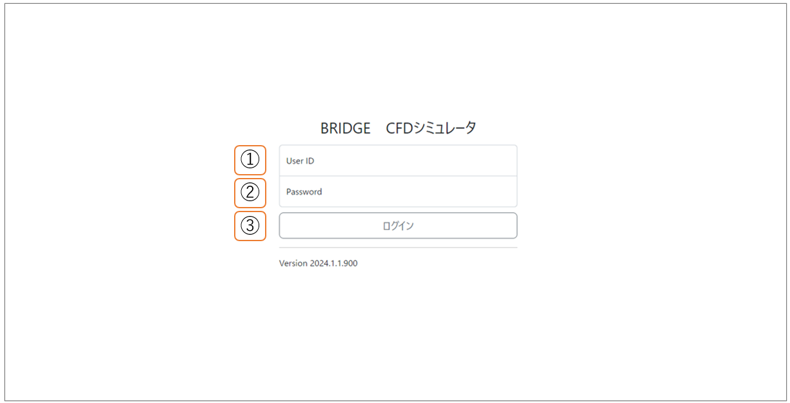

## 2-1 トップ画面

本システムへログインすると以下のシミュレーションモデル一覧画面が表示されます。\
ここでは、共通レイアウトについて紹介します。

① メニュー

ホームやシミュレーションモデル一覧、熱流体解析ソルバー一覧など他の一覧画面への遷移が可能です。

② ログインユーザー表示

現在ログインしているユーザー名が表示されます。編集は不可能です。

③ ログアウト

ログインユーザーを本システムからログアウトし、ログイン画面へ遷移します。

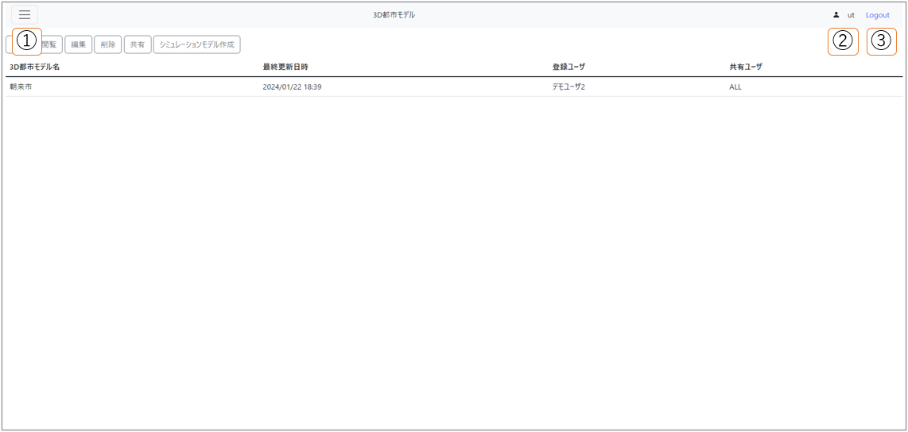

①のメニューからは4つの画面へ遷移が可能です。

- 2-2  ホーム画面
- 2-3  3D都市モデル一覧画面
- 2-5  シミュレーションモデル一覧画面
- 2-7  解析ソルバー一覧画面

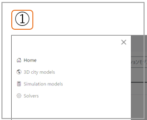

## 2-2 ホーム画面

システム管理者からユーザーへ本システムに関する伝達事項など、Webアプリの実装に組み込まれた静的なコンテンツを表示します。

## 2-3 3D都市モデル一覧画面

① 追加

基礎自治体や分析対象地域の3D都市モデル追加画面へ遷移します。

② 閲覧

3D都市モデルを選択した状態でボタン押下することで、3D都市モデル閲覧画面へ遷移します。

③ 編集

選択されている3D都市モデルに付帯した情報の編集画面へ遷移します。

④ 削除

選択されている3D都市モデルを本システムより削除し、⑦一覧表を更新します。

⑤ 共有

選択されている3D都市モデルを他のログインユーザも閲覧可能な状態とします。

⑥ シミュレーションモデル作成

選択されている3D都市モデルの[ 2-4 シミュレーションモデル作成画面 ]へ遷移します。

⑦ 一覧表

本システムに登録されている3D都市モデルを一覧表示します。

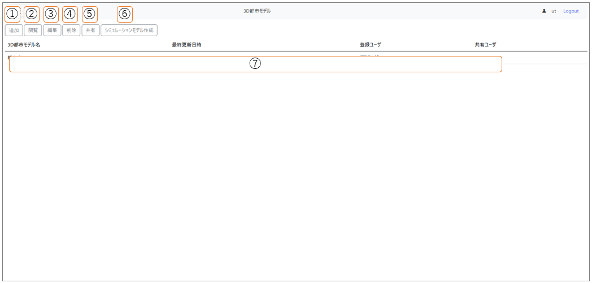

## 2-4 シミュレーションモデル作成画面

① 都市モデル表示

3D都市モデルの識別名の表示欄です。

② シミュレーションモデル名入力

シミュレーションモデル名（識別名）の入力欄です。

③ 解析対象地域一覧表

3D都市モデルと紐づき本システムに登録されている解析対象地域を一覧表示します。

⑤ 追加と戻る

シミュレーションモデル名が入力され解析対象地域も選択された状態で追加ボタンを押下すると、新規シミュレーションモデルが本システムに登録されます。\
戻るを押下した場合、[2-3 3D都市モデル一覧画面] に遷移します。

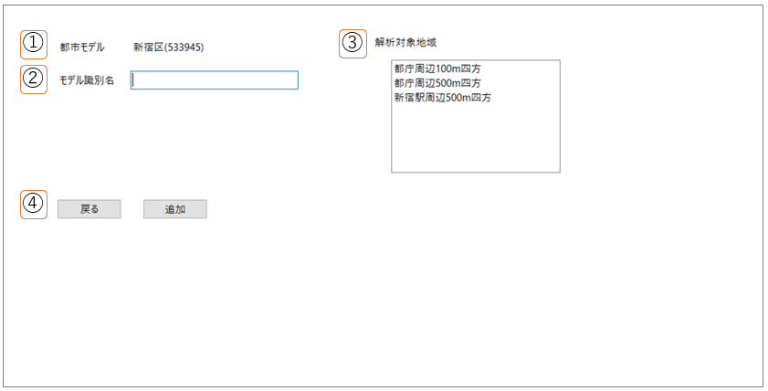

## 2-5 シミュレーションモデル一覧画面

① 複製

選択されているシミュレーションモデルの一部を複製します。

② 編集

シミュレーションモデルの編集画面へ遷移します。

③ 削除

選択されているシミュレーションモデルを本システムより削除し、⑦一覧表を更新します。

④ 共有

選択されているシミュレーションモデルを他のログインユーザも閲覧可能な状態とします。

⑤ 公開

選択されているシミュレーションモデルを公開し、ログイン認証なしでアクセスできるURLを提供します。

⑥ 公開停止

選択されているシミュレーションモデルの公開を停止します。

⑦ シミュレーション開始

選択されているシミュレーションモデルについてシミュレーションを開始します。

⑧ ステータス詳細

選択されているシミュレーションモデルについて、シミュレーションの実施状況を確認します。

⑨ 中止

ステータスが実行中にあるシミュレーションモデルが選択されているとき、中止処理が実行されます。

⑩ シミュレーション結果閲覧

シミュレーションモデルを選択した状態で押すと、[ 2-6 シミュレーションモデル結果閲覧画面 ]へ遷移します。

⑪ 一覧表

本システムに登録されているシミュレーションモデルを一覧表示します。

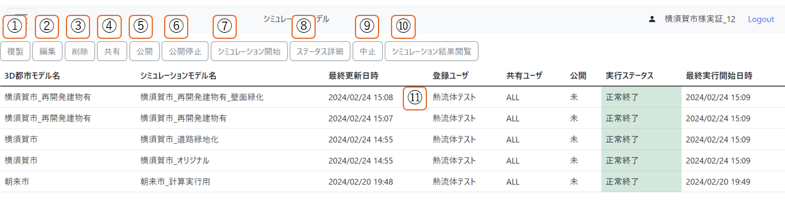

## 2-6 シミュレーションモデル結果閲覧画面

① 表示情報選択

表示されるシミュレーションモデルの結果情報を選択できます。

② 高さ選択

表示されるシミュレーション結果の流速、温度について地表からの高さを選択できます。

③ シミュレーション結果

①と②を選択した情報でシミュレーション結果を描画表示します。

④ 戻る

押下した場合、[ 2-5 シミュレーションモデル一覧画面 ] に遷移します。

⑤ ダウンロード

①と②で選択した情報のSV5シミュレーション結果（GeoJSON）ファイルをダウンロードします。

⑥ 凡例

表示情報選択の選択状態に応じて、それぞれの指数に応じた凡例を表示します。

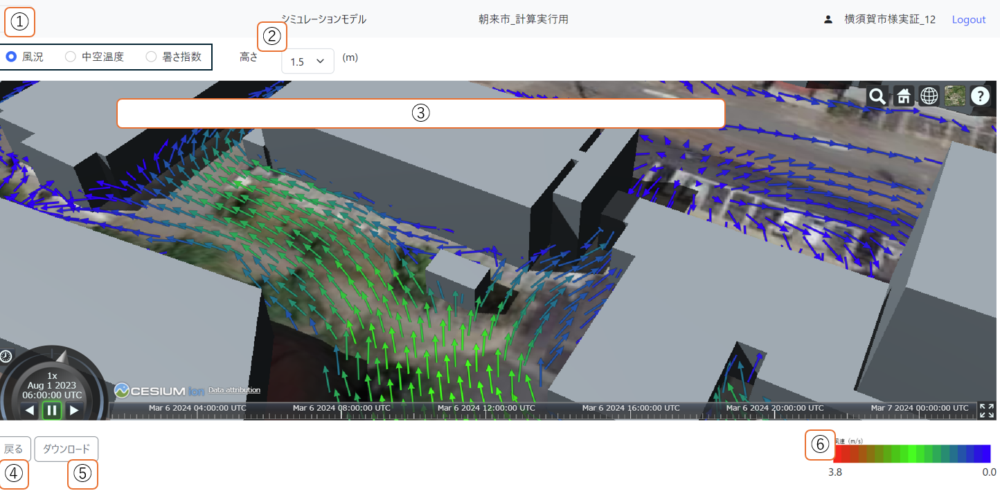

## 2-7 解析ソルバー一覧画面

① ソルバ識別名入力欄

ソルバ追加または更新したいときにソルバ識別名を入力します。

② 説明入力欄

ソルバ追加または更新したいときにソルバに関する説明を入力します。

③ 追加

追加したいソルバ情報を①に入力しボタン押下することで、解析ソルバーが追加されます。

④ 更新

更新したいソルバ情報を①に入力しボタン押下することで、解析ソルバーが更新されます。

⑤ 公開

選択されている解析ソルバーを他ユーザにも公開します。

⑥ 削除

選択されている解析ソルバーを本システムより削除し、⑦一覧表を更新します。

⑦ ダウンロード

選択されている解析ソルバーをダウンロードします。

⑧ 一覧表

本システムに登録されている解析ソルバーを一覧表示します。

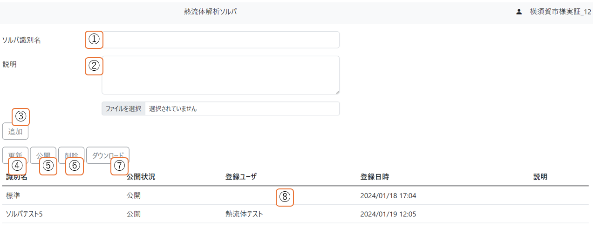

# 3 -基本操作- 都市計画コンサル会社等(エンジニア属性ユーザ)向け

## 3-1 STLファイルの作成（外部システム操作）

解析対象地域の建物および地形（地表面）の形状データをシステム外で作成します。本システムで熱流体解析処理に利用できるデータフォーマットは、STLファイル形式およびWavefront .objファイル形式です。\
エンジニア属性ユーザは、データ変換ツール（例：FME Desktop）を用いて、PLATEAUで提供されているLOD1の3D都市モデルから、前述のいずれかのファイル形式に変換します。このとき建物・地形ごとの排熱効率の違いを加味するために、建物用途や土地利用用途といった主題属性に基づいて建物や地表面のオブジェクトを分類し、複数のファイルを用意します。

STLファイル作成に利用する3D都市モデル（CityGML）の項目を下表に例示します。

| 地物 | 地物型 | 属性区分 | 属性名 |
| - | - | - | - |
| 建築物LOD1 | bldg:Building | 空間属性 | bldg:lod1Solid |
|  |  | 主題属性 | bldg:usage |
| 土地利用 | luse:LandUse | 主題属性 | luse:class |
| 地形LOD1 | dem:TINRelief | 空間属性 | dem:tin |

建物のオブジェクトを主題属性（建築物用途）に基づいて分類する方法を下表に例示します。

| 種別名 | 建築物用途(bldg:usage) |
| - | - |
| 建物(事務所) | 401,421 |
| 建物(商業施設) | 402,404 |
| 建物(宿泊施設) | 403 |
| 建物(住宅) | 411,412,413,414,415 |
| 建物(教育施設) | 422 |
| 建物(その他) | 431,441,451,452,453,454,461 |

地形のオブジェクトを主題属性（土地利用用途）に基づいて分類する方法を下表に例示します。

| 種別名 | 土地利用用途(luse:class) |
| - | - |
| 地表面(公園)  | 217,218 |
| 地表面(水面) | 204 |
| 地表面(道路)  | 215,216,222,262 |
| 地表面(緑地)  | 201,202,203,205,220,260 |
| 地表面(その他) | 上記以外 |

## 3-2 都市モデルの登録

1. ログイン後、トップ画面の[ 2-3 3D都市モデル一覧画面 ]で、追加ボタンを押下します。

2. [ 3D都市モデル追加画面 ]が表示されたら、モデル識別名（3D都市モデル名）の入力および都市モデルの3Dタイルを選択し、追加ボタンを押下します。

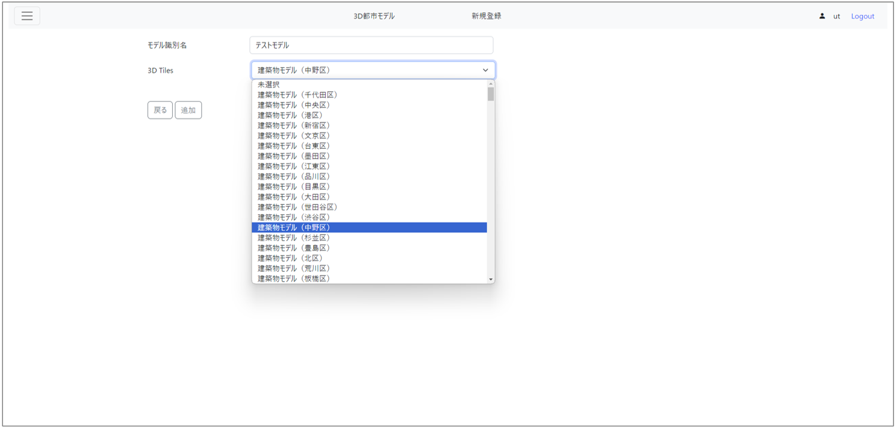

3. 新しく追加された行を選択し、編集ボタンを押下します。

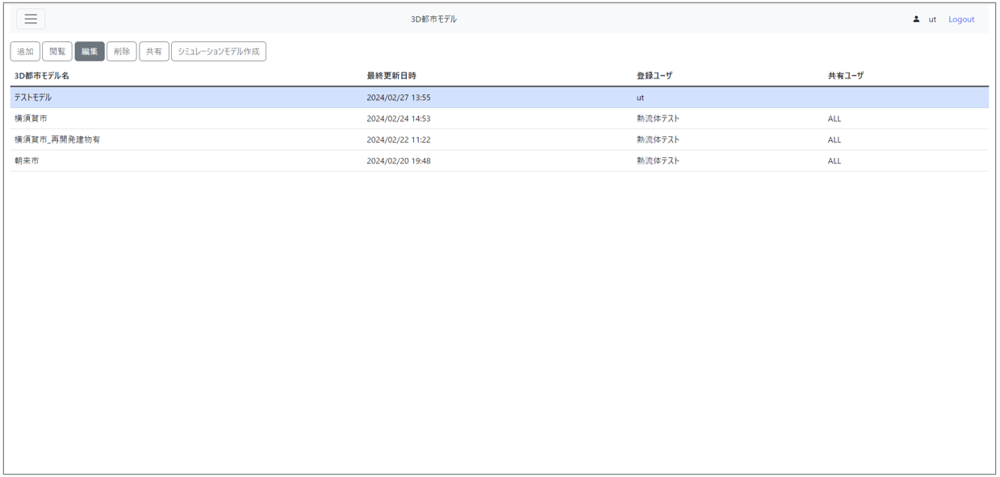

4. [ 3D都市モデル付帯情報編集画面 ]で、[ 3-1 STLファイルの作成 ]で用意したSTLファイルをアップロードします。

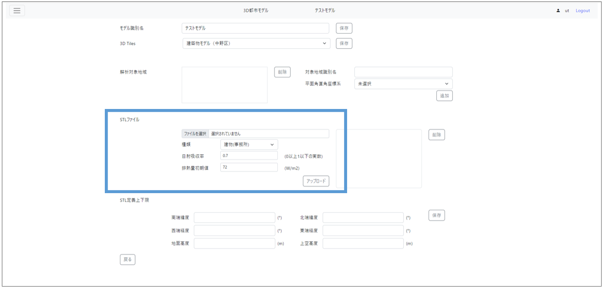

5. 情報の追加・編集・削除を終えたら、左下の、戻すボタンを押下します。

# 4 -基本操作-　地方公共団体職員等(ノンエンジニア属性ユーザ)向け

## 4-1 シミュレーションモデルの作成

1. ログイン後、トップ画面の[ 2-3 3D都市モデル一覧画面 ]で、シミュレーションモデル作成ボタンを押下します。

2. [ 2-4 シミュレーションモデル作成画面 ]が表示されたら、モデル識別名の入力および[ 3-2 都市モデルの登録 ]などで登録した解析対象地域を選択し、追加ボタンを押下します。

## 4-2 シミュレーションモデルの実行

1. ログイン後、トップ画面のメニューから[ 2-5  シミュレーションモデル一覧画面 ]へ遷移します。

2. 一覧表示されている中から、実行したいシミュレーションモデルを選択します。

3. 2.で選択した状態のままシミュレーション開始ボタンを押下すると、シミュレーションが開始します。

## 4-3 シミュレーション結果の閲覧

1. ログイン後、トップ画面のメニューから[ 2-5 シミュレーションモデル一覧画面 ]へ遷移します。

2. 一覧表示されている中から、シミュレーション実行ステータスが「正常終了」となっているシミュレーションモデルを選択します。

3. 2.で選択した状態のままシミュレーション結果閲覧ボタンを押下すると、シミュレーション結果閲覧画面で風況、中空温度、暑さ指数のシミュレーション結果を閲覧できます。

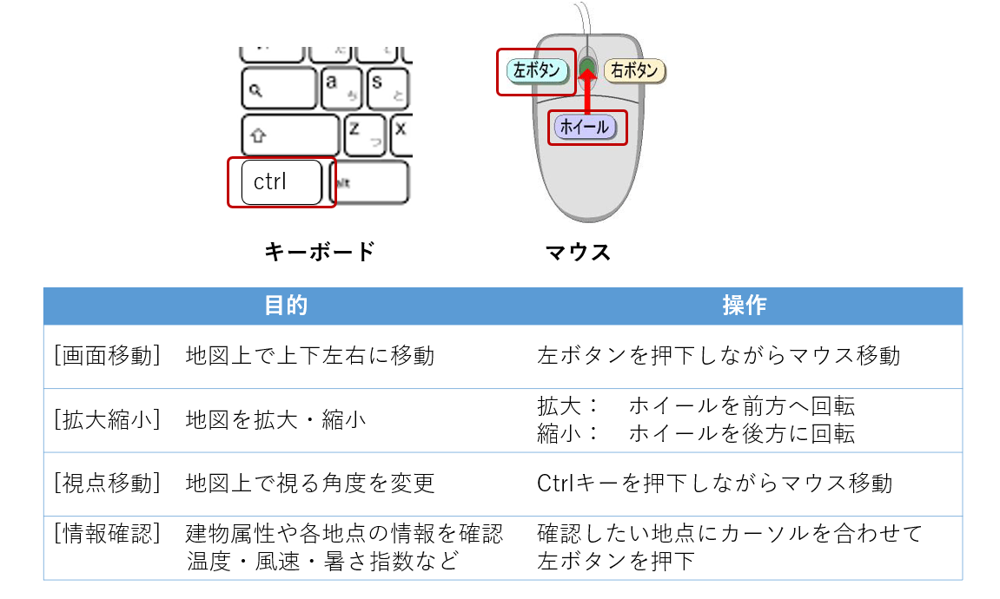

## 4-4 シミュレーションモデルの複製と再実行

1. ログイン後、トップ画面のメニューから[ 2-5  シミュレーションモデル一覧画面 ]へ遷移します。

2. 一覧表示されている中から、複製したいシミュレーションモデルを選択します。このとき、シミュレーション実行ステータスが「正常終了」であることを確認してください。

3. 2.で選択した状態のまま複製ボタンを押下すると、シミュレーション実行ステータスが「未」で新しい行が追加されます。

4. 新しく追加された行を選択し、編集ボタンを押下します。

5. [ シミュレーションモデル編集画面 ] で、シミュレーション実施条件の「外力等環境条件」を変更します。

6. 「保存に続けてシミュレーションを開始する」にチェックをつけ、保存ボタン押下します。シミュレーションが開始します。

7. しばらく時間経過後、[ 2-5  シミュレーションモデル一覧画面 ]で更新ボタンを押下します。

8. [ 4-1 シミュレーション結果の閲覧 ]に記述した手順と同様に、シミュレーション結果を閲覧できます。

## 4-5 シミュレーション結果の共有

1. ログイン後、トップ画面のメニューから[ 2-5  シミュレーションモデル一覧画面 ]へ遷移します。

2. 一覧表示されている中から、共有したいシミュレーションモデルを選択します。

3. 2.で選択した状態のまま共有ボタンを押下すると、[ モデル共有画面 ]が表示されます。

4. 共有先のユーザーIDを指定し、共有ボタンを押下します。

共有先のユーザー　：　4.以降で本システムへログインし、[ 2-5 シミュレーションモデル一覧画面 ] へ遷移すると、共有されたシミュレーションモデルが新しく追加されていることを確認できます。

## 4-6 シミュレーション結果の一般公開

1. ログイン後、トップ画面のメニューから[2-5  シミュレーションモデル一覧画面 ]へ遷移します。

2. 一覧表示されている中から、公開したいシミュレーションモデルを選択します。

3. 2.で選択した状態のまま公開ボタンを押下すると、一般公開します。

確認方法　：　公開ボタンを押下したあとに表示されるメッセージダイアログに公開先のURLを別のPCなどからアクセスします。

# 5 -応用操作-　
## 5-1 GISソフトを用いたシミュレーション結果の表示

1. [ シミュレーション結果閲覧画面 ]でダウンロードボタンを押下し、GeoJSONファイルをダウンロードします。

2. 【外部システム】 GISソフトウェアでGeoJSONファイルをインポートし、表示します。

## 5-2 オリジナルソルバの利用

1. ログイン後、トップ画面のメニューから[ 2-7  解析ソルバー一覧画面 ]へ遷移します。

2. 「標準」ソルバ以外のソルバを選択し、ダウンロードボタンを押下すると、tarファイルがダウンロードされます。

3. 【外部システム】 ダウンロードしたtarファイルを展開します。

4. 【外部システム】 シミュレーションモデル仕様書に基づいて、ソルバやモデルファイルを改変します。

5. [2-7  解析ソルバー一覧画面]でアップロードボタンを押下し、改変したtarファイルを選択します。

6. [ シミュレーションモデル編集画面 ]の解析ソルバで、オリジナルソルバを選択します。

7. 以降は、[ 4 基本操作 ]を参考に、シミュレーションモデルの編集やシミュレーション実行、結果の閲覧を行います。